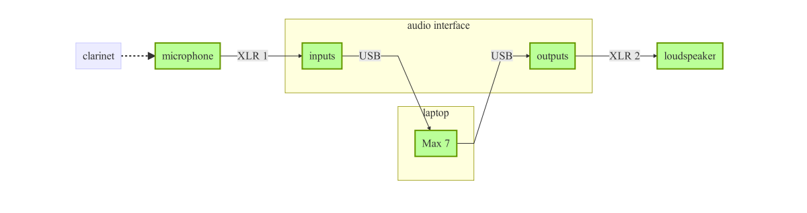

# Wege & Waldstille

Delay line performance patch for [_Wege & Waldstille_](http://chrisswithinbank.net/2010/04/wegen-und-waldstille/), for clarinet, percussion, piano, cello and electronics. New patch built for March 2017 performance superseding original 2010 patch.

### System requirements

This patch is designed to run in [Max 7](https://cycling74.com/products/max/). It should run in earlier versions, but the interface will not appear as expected.

### Technical rider

* microphone for clarinet
* 2 XLR cables
* USB audio interface
* laptop with Max 7 installed, running `wege-und-waldstille.maxpat`
* loudspeaker

